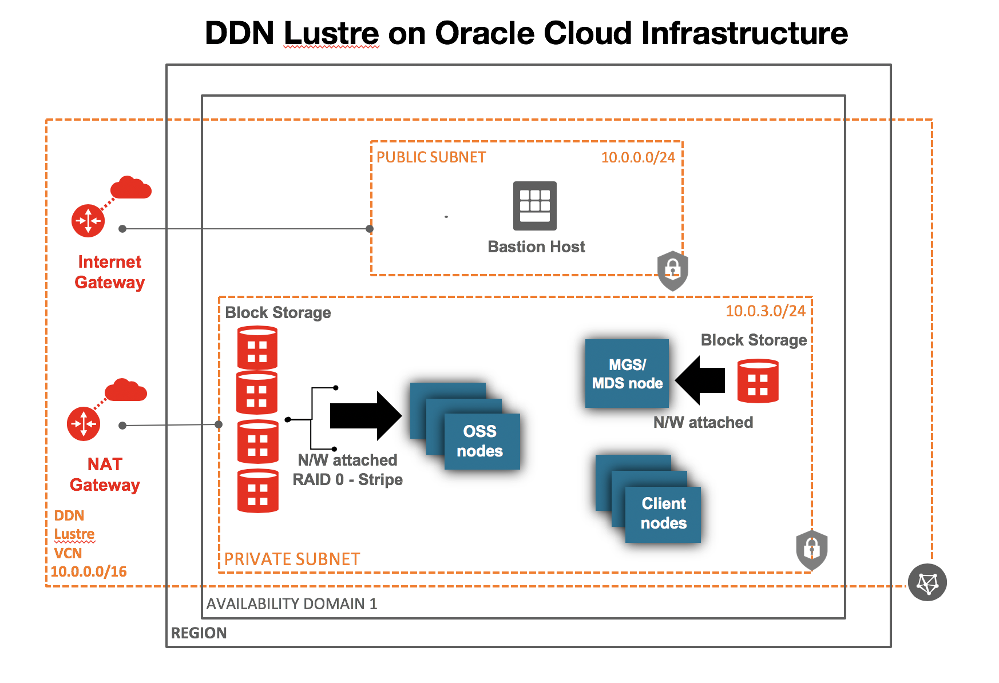

# oci-lustre
Terraform template to deploy Lustre file system on Oracle Cloud Infrastructure (OCI).

# High Level Architecture 

## Prerequisites
In addition to an active tenancy on OCI, you will need a functional installation of Terraform, and an API key for a privileged user in the tenancy.  See these documentation links for more information:

[Getting Started with Terraform on OCI](https://docs.cloud.oracle.com/iaas/Content/API/SDKDocs/terraformgetstarted.htm)

[How to Generate an API Signing Key](https://docs.cloud.oracle.com/iaas/Content/API/Concepts/apisigningkey.htm#How)

Once the pre-requisites are in place, you will need to copy the templates from this repository to where you have Terraform installed.

## Clone the Terraform template
Now, you'll want a local copy of this repo.  You can make that with the commands:

    git clone https://github.com/pvaldria/oci-lustre.git
    cd oci-lustre/terraform
    ls

## Update Template Configuration
Update environment variables in config file: [env-vars](https://raw.githubusercontent.com/pvaldria/oci-lustre/master/terraform/env-vars)  to specify your OCI account details like tenancy_ocid, user_ocid, compartment_ocid and source this file prior to installation, either reference it in your .rc file for your shell's or run the following:

        cd ./terraform
        vim env-vars
        source env-vars

## Update variables.tf file (optional)
This is optional, but you can update the variables.tf to change compute shapes, block volumes, etc. 

## Deployment & Post Deployment

Deploy using standard Terraform commands

        cd terraform
        terraform init && terraform plan && terraform apply

